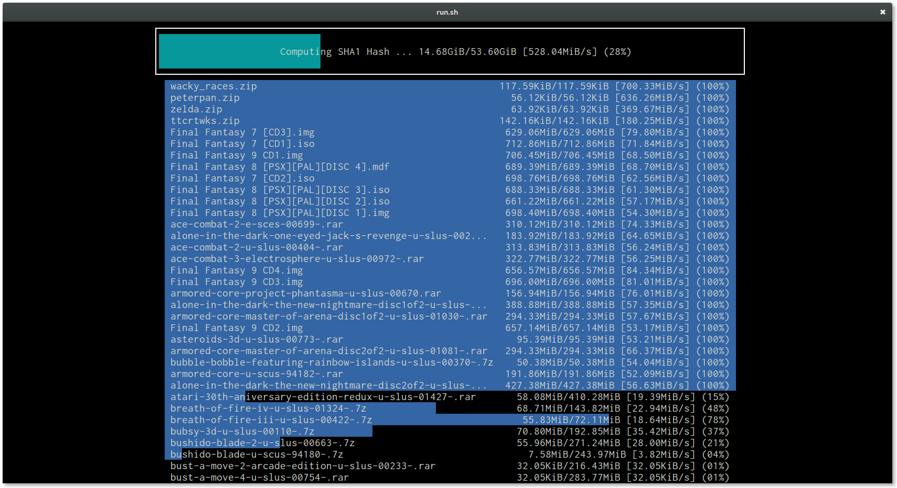
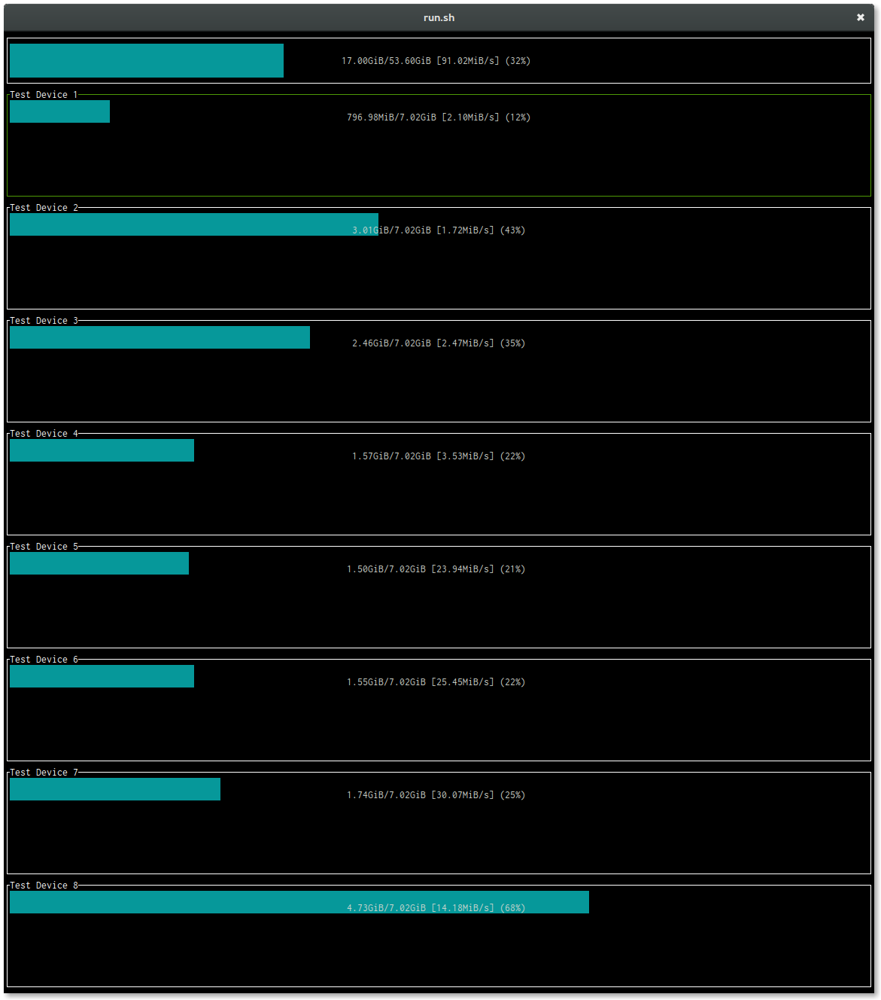

============================
Generic Device Storage (gds)
============================

GDS syncs files from one large storage pool, to multiple dissimilar devices asynchronously.

.. warning:: This is alpha software. Use only if you know what you are doing. GDS currently has no way to restore from
             backups.

-----------------
Sha1 hashing view
-----------------

--------------------------------
GDS syncing to 8 devices at once
--------------------------------

------
How-to
------

1. Get source

   .. code:: console

      git clone https://github.com/constabulary/gb.git
      git clone https://github.com/demizer/gds.git

#. Build and use

   .. code:: console

      gb test -v && gb build && ./bin/gds
