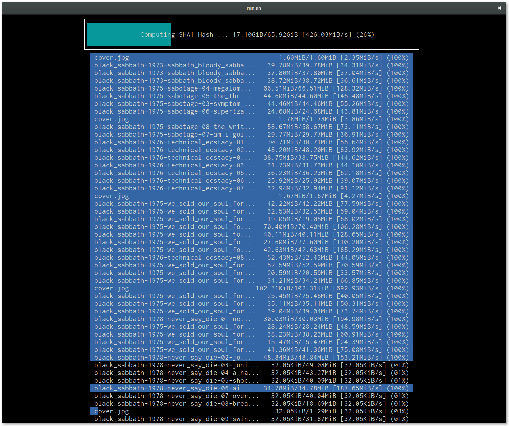

============================
Generic Device Storage (gds)
============================

GDS syncs files from one large storage pool, to multiple dissimilar devices asynchronously.

.. warning:: This is alpha software. Use only if you know what you are doing. GDS currently has no way to restore from
             backups.

-----------------
Sha1 hashing view
-----------------

Hashing eight files at a time.

------------------------------------
GDS syncing to eight devices at once
------------------------------------

.. image:: data/images/Screenshot_from_2016-02-14_12-22-35.png

The slow copy speeds in this image is because these devices are loop mounted. When copying to individual SATA or USB
devices, the performance is typical of other copying tools.

------
How-to
------

1. Get source

   .. code:: console

      git clone https://github.com/constabulary/gb.git
      git clone https://github.com/demizer/gds.git

#. Build and use

   .. code:: console

      gb test -v && gb build && ./bin/gds
